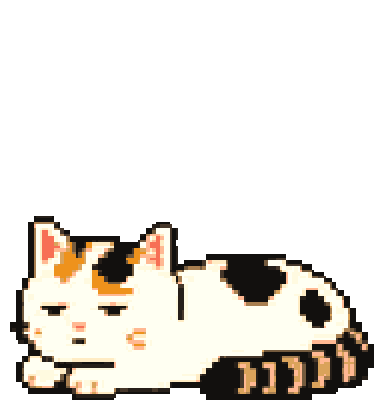

# 糕糕桌宠

[](https://github.com/LaoZhong-Mihari/gaogao-desktop-pet/actions/workflows/ci.yml)

糕糕是一只可安装在 macOS 和 Windows 上的独立桌宠。应用使用 Tauri 2 + TypeScript 构建，所有动画和设置都在本机运行：**无需 Codex、无需 Python、无需登录，也不会连接网络服务**。

> 当前版本是未签名 beta。macOS Gatekeeper 或 Windows SmartScreen 可能在首次打开时显示安全提醒，请确认安装包来自本仓库的 [Releases](https://github.com/LaoZhong-Mihari/gaogao-desktop-pet/releases) 页面，并可用同一版本附带的 `SHA256SUMS.txt` 核对文件。

## 下载与安装

### macOS 12 或更高版本

发布包为同时支持 Apple Silicon 与 Intel Mac 的 Universal 版本。

1. 在 [Releases](https://github.com/LaoZhong-Mihari/gaogao-desktop-pet/releases) 下载 `.dmg`。
2. 打开 DMG，把“糕糕”拖入“应用程序”文件夹。
3. 因首批 beta 尚未签名及公证，首次打开时请在 Finder 中按住 Control 点击应用，选择“打开”；如仍被阻止，可前往“系统设置 → 隐私与安全性”，确认来源后选择“仍要打开”。

Release 同时提供 `.app.tar.gz`，适合不使用 DMG 的用户。解压后将应用移入“应用程序”文件夹，再按上述方式首次打开。

### Windows 10 / 11（x64）

1. 在 [Releases](https://github.com/LaoZhong-Mihari/gaogao-desktop-pet/releases) 下载 NSIS 安装包 `.exe`。
2. 运行安装包并按提示完成安装。
3. 因首批 beta 尚未进行 Authenticode 签名，如 SmartScreen 出现提醒，请核对下载来源与 SHA-256 后，选择“更多信息 → 仍要运行”。

不要从第三方网盘或转载页面下载安装包。正式版签名与公证会在后续发布中加入。

### 核对下载文件

把安装包与同一 Release 的 `SHA256SUMS.txt` 下载到同一目录。macOS 可计算所下载文件的摘要，再与清单中的对应行比较：

```bash
shasum -a 256 ./下载的文件.dmg
```

Windows PowerShell 可计算安装包摘要，再与 `SHA256SUMS.txt` 中对应行比较：

```powershell
Get-FileHash .\*.exe -Algorithm SHA256
```

## 怎么陪糕糕玩

- 拖动糕糕：移动桌宠；拖动时会播放跑动动画。
- 单击糕糕：挥爪。
- 双击糕糕：跳跃。
- 右键糕糕：打开快捷菜单，可直接触发“颓废舔毛”。
- 偶尔注视：空闲时会随机触发约 5 秒注视；触发期间糕糕会持续看向当前鼠标方向，结束后停止跟随。没有触发时不会常驻追踪鼠标。
- 拖动文件靠近：从桌面或文件管理器拿起文件并开始移动时，糕糕会在文件尚未进入自身窗口前就持续看向当前鼠标；松开后停止。
- 注视定位：16 个方向以糕糕面部而不是透明窗口中心为原点，多显示器缩放下也会换算到糕糕所在屏幕的坐标基准。
- 注视素材：16 个方向均由图像模型按同一像素风完整绘制头、短颈、肩和前胸，再与固定底盘注册；不使用脚本绘制表情、瞳孔或五官。
- 喂猫条：首次启动会在桌面放置“糕糕的猫条（拖给糕糕）.png”。把它拖进糕糕窗口，验证成功后糕糕会直接长大 2–5%，累计最多 50%；猫条可以重复使用。需要恢复时，可从糕糕右键菜单或托盘选择“恢复原大小”，只清除喂食增量，不改变设置中的基础尺寸。
- 放着不管：糕糕会随机发呆、忙碌或连续颓废舔毛；空闲约 45 秒后也可能从当前位置开始左右散步。
- 待机节奏：使用 Codex Pet 实际运行时的 6× 慢速节奏，一轮约 6.6 秒。



托盘菜单提供显示/隐藏、暂停/继续、颓废舔毛、把猫条放回桌面、恢复原大小、始终置顶、开机启动、设置和退出。设置页可调整：

- 显示尺寸：75%、100%、125% 或 150%；
- 始终置顶、偶尔注意鼠标和文件、自动漫步；
- 是否开机启动（默认关闭）；
- 查看吃猫条获得的成长比例，或重新把猫条放到桌面。

设置、成长比例与最后位置只保存在本机。糕糕支持多显示器，重新启动时会尽量恢复上次位置；若显示器布局改变，则会自动把窗口移回可见区域。

## 完全离线

应用本体不包含遥测、广告、账户、云端 AI 或自动更新，也不会发出网络请求。操作系统、GitHub 或浏览器在下载安装包时产生的数据不属于应用本体。完整说明见 [PRIVACY.md](PRIVACY.md)。

## 从源码运行

需要：

- Node.js 22 LTS 与 npm；
- Rust stable；
- macOS：Xcode Command Line Tools（`xcode-select --install`）；
- Windows：Microsoft C++ Build Tools（勾选“使用 C++ 的桌面开发”）与 Microsoft Edge WebView2 Runtime。

系统依赖的安装细节可参考 [Tauri 2 官方前置要求](https://v2.tauri.app/start/prerequisites/)。

安装依赖并运行开发版：

```bash
npm ci
npm run tauri dev
```

运行静态检查与测试：

```bash
npx tsc --noEmit
npx vitest run
cargo fmt --manifest-path src-tauri/Cargo.toml --all -- --check
cargo clippy --manifest-path src-tauri/Cargo.toml --all-targets --all-features -- -D warnings
cargo test --manifest-path src-tauri/Cargo.toml --all-features
```

构建当前平台安装包：

```bash
npm run tauri build
```

构建 macOS Universal 的 APP 与 DMG：

```bash
rustup target add aarch64-apple-darwin x86_64-apple-darwin
npm run tauri build -- --target universal-apple-darwin --bundles app,dmg
```

构建 Windows x64 NSIS 安装包（在 Windows 上运行）：

```powershell
rustup target add x86_64-pc-windows-msvc
npm run tauri build -- --target x86_64-pc-windows-msvc --bundles nsis
```

## 发布

推送 `v*` 标签会触发 GitHub Actions，在 macOS 与 Windows runner 上构建原生安装包，并创建 prerelease：

```bash
git tag v0.1.0-beta.9
git push origin v0.1.0-beta.9
```

发布标签必须与 `package.json`、`src-tauri/tauri.conf.json` 和 `src-tauri/Cargo.toml` 的版本完全一致；当前 `0.1.0-beta.9` 对应标签 `v0.1.0-beta.9`。工作流会将 Universal DMG、压缩 APP、Windows x64 NSIS EXE 和 `SHA256SUMS.txt` 上传到同一 Release。

## 许可

- 程序代码使用 [MIT License](LICENSE)。
- 糕糕角色、精灵图、图标及其衍生视觉内容**不适用 MIT License**，版权保留；详见 [ASSET_LICENSE.md](ASSET_LICENSE.md)。

未经许可，不得单独转载、再分发、商用或改作糕糕素材。
